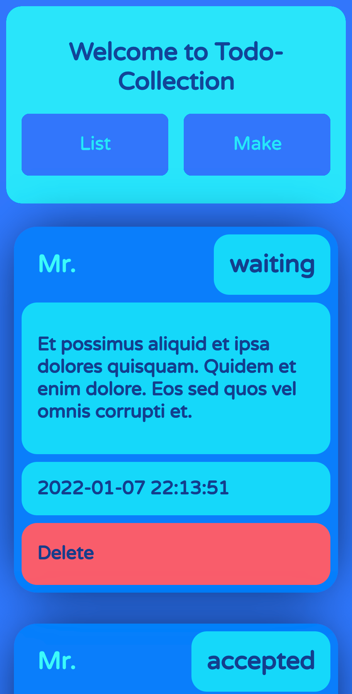
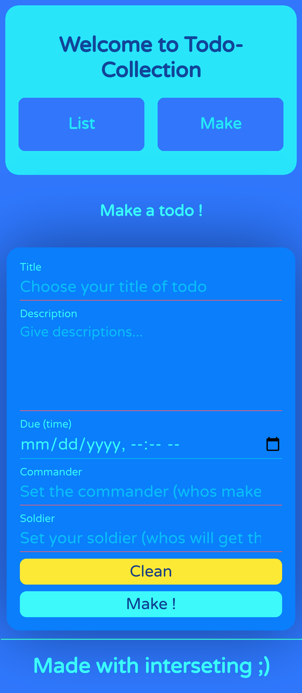

In the name of kindly generous ALLAH 
Thanks ALLAH 
 
 
#TodoCollection
 
#Laravel
<pre>
You can manage your own todos...

For any todo considered:
    + title
    + description
    + status
    + due
    + commander
    + soldier

You can list/make :
list ui:

make ui:

</pre>